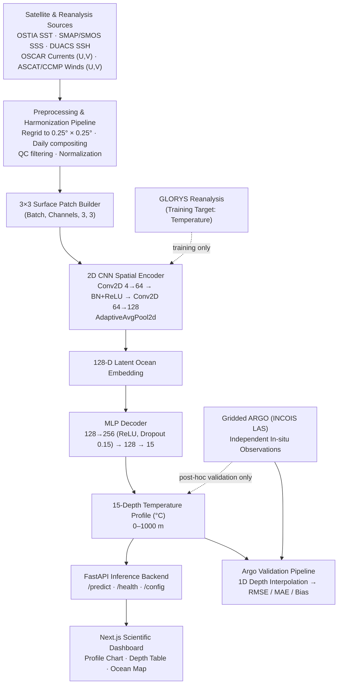

# OceanXRay 🌊 — OceanEmbed for SIH 2026 (PS #26066)

**OceanXRay** is a satellite-embedding-based deep learning platform that reconstructs the **15-depth vertical subsurface ocean temperature profile** of the **North Indian Ocean** from daily surface satellite observations — built for **Smart India Hackathon 2026, Problem Statement #01 (OceanEmbed)**.

The platform combines a **PyTorch CNN Encoder–Decoder** reconstruction model, a **FastAPI** inference backend, and a **Next.js + TypeScript** scientific monitoring dashboard, validated post-hoc against real **Argo** profiling float observations.

---

## 🏆 Smart India Hackathon 2026 — Problem Statement

| Field | Detail |
|---|---|
| **PS Number** | PS #26066 |
| **PS Title** | OceanEmbed – Satellite Embedding-Based Deep Learning Framework for Reconstruction of Subsurface Ocean Temperature from Surface Satellite Observations |
| **Organization** | Indian National Centre for Ocean Information Services (INCOIS), Ministry of Earth Sciences, Government of India |
| **Theme** | Disaster Management |
| **Category** | Software |
| **Domain** | North Indian Ocean — 5°N–30°N, 45°E–105°E |

INCOIS delivers ocean advisory services across two domains — **disaster-related services** (tsunami, storm surge, high wave, swell surge and coastal current early warning) and **ecosystem-based services** (fisheries, coastal zone management, marine ecosystem monitoring). Subsurface temperature is a core variable behind both: it drives ocean heat content, stratification, marine heatwave detection, and data assimilation, but direct in-situ measurement (Argo floats, moored buoys, gliders) is spatially and temporally sparse. OceanXRay addresses this gap by learning a mapping from dense, continuous **satellite surface fields → subsurface thermal structure**, using compact learned embeddings rather than classical statistical interpolation.

---

## 🔬 Scientific Context & Domain

- **Target Domain:** North Indian Ocean — Arabian Sea, Bay of Bengal, Equatorial Channel, Andaman Sea
  - Latitude: **5.0°N – 30.0°N**
  - Longitude: **45.0°E – 105.0°E**
- **Spatial resolution:** 0.25° × 0.25° (standardized across all input sources)
- **Temporal resolution:** Daily
- **Reconstruction depth range:** Surface → **1000 m**
- **Scientific Integrity Protocol:** Argo autonomous profiling float data is used **exclusively** for independent post-hoc validation. It is never used during training, normalization, loss computation, hyperparameter tuning, or checkpoint selection.

### 🌊 Standard Oceanographic Depths (15 levels, as per PS specification)

```
[0, 5, 10, 20, 30, 50, 75, 100, 125, 150, 200, 300, 500, 700, 1000] meters
```

- **5 m** — mixed-layer baseline
- **125 m** — lower thermocline transition

These realign the model to the PS-mandated depth grid (earlier prototype iterations extended to 1500 m with a coarser grid; the production configuration matches the SIH 2026 specification exactly).

---

## 🧭 System Block Diagram



**Data flow in words:** daily gridded surface fields (SST, SSS, SSH/SLA, surface currents, surface winds) are harmonized to a common 0.25° grid, cropped into a 3×3 spatial patch around the target point, encoded by a 2D CNN into a 128-D latent ocean embedding, and decoded by an MLP into a continuous 15-depth temperature profile. GLORYS reanalysis temperature supplies training targets; independent Gridded Argo observations are reserved purely for post-hoc skill evaluation.

---

## 🧠 Machine Learning Architecture

The production model is `OceanCNNEncoderDecoder`.

```text
3×3 Satellite Surface Patch × N Channels
│
├── Channel 0: Sea Surface Temperature (SST)
├── Channel 1: Sea Surface Salinity (SSS)
├── Channel 2: Sea Surface Height Anomaly / SLA (SSH)
└── Channel 3: Spatio-Temporal Proxy (day-of-year + coordinates)
       │
       ▼
┌─────────────────────────────────┐
│       2D CNN Spatial Encoder    │
│ Conv2D: 4 → 64                  │
│ BatchNorm2d + ReLU              │
│ Conv2D: 64 → 128                │
│ AdaptiveAvgPool2d / Flatten     │
└─────────────────────────────────┘
       │
       ▼
   128-D Latent Bottleneck
       │
       ▼
┌─────────────────────────────────┐
│          MLP Decoder            │
│ Linear: 128 → 256 + ReLU        │
│ Dropout: p = 0.15               │
│ Linear: 256 → 128 + ReLU        │
│ Linear: 128 → 15                │
└─────────────────────────────────┘
       │
       ▼
15-Depth Continuous Temperature Profile (°C)
```

### Model Specifications

| Parameter | Specification |
|---|---|
| Model | `OceanCNNEncoderDecoder` |
| Input Tensor | (Batch, 4, 3, 3) |
| Input Patch | 3×3 spatial patch |
| Input Channels | SST, SSS, SSH, Spatio-Temporal Proxy |
| Encoder | 2D CNN + BatchNorm + ReLU |
| Latent Dimension | 128 |
| Decoder | Multi-Layer Perceptron |
| Dropout | 0.15 |
| Output Dimension | (Batch, 15) |
| Prediction | Vertical temperature profile (°C) |
| Maximum Depth | 1000 m |

### 🕐 Temporal Encoding

`predict(latitude, longitude, date_str)` — the supplied date is converted into day-of-year features so the model can account for seasonal phase (southwest / northeast monsoon transitions, seasonal SST change, seasonal upper-ocean stratification shifts).

---

## 📡 Training & Validation Datasets (per PS specification)

### Input (surface) variables

| Variable | Product & Resolution | Source |
|---|---|---|
| SST | OSTIA, 0.05°, daily | https://doi.org/10.48670/moi-00168 |
| SSS | SMAP / SMOS, 0.125°, daily | https://doi.org/10.48670/moi-00051 |
| SSH | DUACS, 0.25°, daily | https://doi.org/10.48670/moi-00145 |
| Currents (U, V) | 0.25°, daily | OSCAR L4 OC FINAL V2.0 (PO.DAAC) |
| Winds (U, V) | 0.25°, daily | ASCAT-L2-Coastal / CCMP Winds 10m6hr L4 V3.1 (PO.DAAC) |

All inputs are regridded/interpolated to a common **0.25° × 0.25°, daily** grid before patch extraction.

### Training target

- **GLORYS Global Ocean Reanalysis** — temperature (https://doi.org/10.48670/moi-00021)

### Independent validation (never used in training)

- **Gridded ARGO** — INCOIS Live Access Server (LAS)
- Real Argo NetCDF profiles (`TEMP`, `TEMP_ADJUSTED`, `PRES`, `PRES_ADJUSTED`), quality-flag filtered, from the official Argo GDAC servers (`data-argo.ifremer.fr`, `usgodae.org`)

---

## 🧪 Scientific Integrity & Validation Protocol

Argo observations are reserved exclusively for post-hoc validation and are never used during model training, input normalization, loss computation, hyperparameter tuning, or checkpoint selection — matching the PS requirement to "evaluate the reconstruction using independent observations and standard skill metrics like correlation, RMSE, bias, etc."

**Validation run summary**

| Field | Value |
|---|---|
| Catalog | Argo Real-Time Profiling Array (`indian_ocean_index.csv`) |
| Profiles within domain | 109,654 candidates |
| Validation sample | 25 independent Argo profiling float cycles |
| Evaluation mode | Active PyTorch model, checkpoint `models/cnn_best.pt` |
| Interpolation | Continuous 1D interpolation of Argo pressure levels onto the 15 standard depths |

### 📊 Depth-Stratified Validation Results

| Depth (m) | Argo Mean (°C) | Model Mean (°C) | RMSE (°C) | MAE (°C) | Bias (°C) |
|---:|---:|---:|---:|---:|---:|
| 0 | 29.42 | 28.94 | 0.945 | 0.866 | -0.486 |
| 5 | 29.38 | 28.83 | 0.954 | 0.857 | -0.549 |
| 10 | 29.33 | 28.81 | 0.945 | 0.829 | -0.523 |
| 20 | 29.22 | 28.77 | 0.945 | 0.811 | -0.455 |
| 30 | 29.01 | 28.56 | 0.943 | 0.773 | -0.449 |
| 50 | 28.22 | 27.51 | 1.189 | 1.037 | -0.711 |
| 75 | 26.38 | 25.01 | 2.269 | 1.894 | -1.367 |
| 100 | 22.93 | 21.65 | 3.192 | 2.357 | -1.275 |
| 125 | 18.91 | 18.57 | 2.035 | 1.729 | -0.340 |
| 150 | 16.56 | 16.43 | 1.450 | 1.208 | -0.130 |
| 200 | 13.97 | 14.32 | 1.030 | 0.771 | +0.348 |
| 300 | 11.86 | 12.30 | 0.684 | 0.466 | +0.441 |
| 500 | 10.49 | 10.66 | 0.391 | 0.301 | +0.169 |
| 700 | 9.46 | 9.27 | 0.363 | 0.267 | -0.197 |
| 1000 | 7.56 | 7.18 | 0.499 | 0.415 | -0.380 |
| **Full Column** | **19.85** | **19.46** | **1.403** | **0.972** | **-0.394** |

### 📈 Interpretation

- **Upper mixed layer (0–30 m):** RMSE holds steady around **~0.94°C** — surface-derived inputs constrain near-surface temperature well.
- **Thermocline (75–125 m):** Largest error band; worst at **100 m** (RMSE 3.192°C, MAE 2.357°C, Bias -1.275°C). This region has strong vertical gradients shaped by mesoscale eddies, internal waves, and seasonal forcing — the hardest zone to reconstruct from surface signals alone.
- **Deep ocean (500–1000 m):** Error drops sharply (RMSE 0.36–0.50°C, MAE 0.26–0.42°C) — the model stabilizes at depth.
- **Full column (0–1000 m):** RMSE 1.403°C, MAE 0.972°C, Bias -0.394°C.

### 📐 Metrics used

```
RMSE = √(1/N × Σ(y_pred − y_actual)²)     # penalizes large errors
MAE  = 1/N × Σ|y_pred − y_actual|          # average absolute error
Bias = 1/N × Σ(y_pred − y_actual)          # negative = underestimate, positive = overestimate
```

---

## 📁 Repository Structure

```
SIH26/
├── backend/
│   ├── config.py            # Domain boundaries, production depth levels & settings
│   ├── main.py               # FastAPI application, CORS, routes & validation
│   ├── model_service.py      # PyTorch OceanCNNEncoderDecoder & ModelService
│   ├── preprocessing.py      # 3×3 surface patch construction & normalization
│   ├── schemas.py            # Pydantic request/response schemas
│   ├── evaluate_argo.py      # Independent Argo post-hoc validation pipeline
│   ├── requirements.txt      # Python dependencies
│   ├── .env                  # Backend environment configuration
│   ├── argo_depth_metrics.csv   # Depth-level RMSE, MAE & Bias results
│   ├── argo_test_results.csv    # Station-level Argo validation predictions
│   └── tests/
│       └── test_api.py       # Automated pytest test suite
│
├── frontend/
│   ├── app/
│   │   ├── dashboard/        # Primary interactive prediction dashboard
│   │   ├── about/             # Scientific overview & architecture
│   │   ├── globals.css        # Oceanographic CSS theme & Leaflet styles
│   │   └── layout.tsx          # Application wrapper & metadata
│   ├── components/
│   │   ├── DashboardHeader.tsx        # Navigation & backend status
│   │   ├── StatusCards.tsx            # Domain & model status cards
│   │   ├── PredictionForm.tsx         # Coordinate/date inputs & preset stations
│   │   ├── OceanMap.tsx                # Dynamic Leaflet domain map
│   │   ├── OceanMapInner.tsx           # Leaflet container & clickable marker
│   │   ├── TemperatureProfileChart.tsx # Inverted vertical depth chart
│   │   ├── DepthTable.tsx              # 15-depth results table & CSV export
│   │   ├── PredictionMetadata.tsx      # Latency, patch summary & metadata
│   │   ├── ErrorMessage.tsx            # User-friendly error banners
│   │   └── LoadingState.tsx            # Inference loading animation
│   ├── lib/
│   │   └── api.ts             # Centralized typed HTTP client
│   ├── .env.local              # Frontend API endpoint configuration
│   └── package.json
│
├── models/
│   ├── .gitkeep
│   └── cnn_best.pt             # Production PyTorch checkpoint
│
└── README.md
```

---

## 🚀 Quick Start

### 1. Backend Setup

Requires Python 3.10+.

```bash
cd backend

pip install -r requirements.txt

# Run automated API tests
python -m pytest tests/test_api.py -v

# Start FastAPI development server
python -m uvicorn main:app --host 0.0.0.0 --port 8000 --reload
```

- API: `http://localhost:8000`
- Docs: `http://localhost:8000/docs`
- Health: `http://localhost:8000/health`
- Config: `http://localhost:8000/config`

### 2. Frontend Setup

Requires Node.js 18+.

```bash
cd frontend

npm install
npm run dev -- -p 3001
```

- Dashboard: `http://localhost:3001/dashboard`
- Scientific overview: `http://localhost:3001/about`

---

## ⚙️ Model Configuration

**Mode 1 — Deterministic Mock Mode** (`MODEL_MODE=mock`): used when the trained checkpoint isn't available. Generates deterministic profiles from latitude, longitude, and seasonal phase; the frontend clearly labels these as **DEMO DATA**.

**Mode 2 — Production PyTorch Model:**

```env
MODEL_MODE=model
MODEL_PATH=models/cnn_best.pt
FRONTEND_ORIGIN=http://localhost:3001
```

Place the trained checkpoint at `models/cnn_best.pt` and restart the backend. `/health` should report:

```json
{
  "status": "ok",
  "model_loaded": true,
  "mode": "model",
  "model_path": "models/cnn_best.pt"
}
```

---

## 📡 API Reference

### `GET /health`
Service availability, model loading status, active inference mode.

### `GET /config`

```json
{
  "latitude_min": 5.0,
  "latitude_max": 30.0,
  "longitude_min": 45.0,
  "longitude_max": 105.0,
  "num_depths": 15,
  "depths": [0.0, 5.0, 10.0, 20.0, 30.0, 50.0, 75.0, 100.0, 125.0, 150.0, 200.0, 300.0, 500.0, 700.0, 1000.0],
  "patch_size": 3,
  "domain_name": "North Indian Ocean (5°N–30°N, 45°E–105°E)",
  "architecture": "3×3 CNN Encoder + 128-D Latent Embedding + MLP Decoder"
}
```

### `POST /predict`

```bash
curl -X POST "http://localhost:8000/predict" \
     -H "Content-Type: application/json" \
     -d '{
       "latitude": 18.50,
       "longitude": 65.00,
       "date": "2025-01-15"
     }'
```

```json
{
  "success": true,
  "mode": "model",
  "is_demo": false,
  "location": { "latitude": 18.5, "longitude": 65.0 },
  "date": "2025-01-15",
  "depths": [0.0, 5.0, 10.0, 20.0, 30.0, 50.0, 75.0, 100.0, 125.0, 150.0, 200.0, 300.0, 500.0, 700.0, 1000.0],
  "temperatures": [25.55, 25.47, 25.39, 25.31, 25.20, 22.84, 19.86, 17.26, 15.00, 13.56, 11.08, 8.22, 6.78, 5.92, 4.81],
  "surface_input_summary": {
    "patch_size": "3x3",
    "channels": ["SST (°C)", "SSS (PSU)", "SSH (m)", "Spatio-Temporal Proxy"]
  },
  "metadata": {
    "model_name": "OceanXRay-OceanCNNEncoderDecoder",
    "inference_time_ms": 0.72
  }
}
```

> Response values above are illustrative; actual model-mode predictions are generated dynamically by the loaded checkpoint.

---

## 🛡️ Validation & Error Handling

- Latitude must be within **5.0°N – 30.0°N**; longitude within **45.0°E – 105.0°E** — else `400 Bad Request`.
- Invalid date strings return `400 Bad Request`.
- Frontend remains usable when the backend is offline: connection status banner, retry, loading states, and clear model/demo indicators.

---

## 🧪 Testing

```bash
# Backend
python -m pytest backend/tests/test_api.py -v

# Frontend production build
cd frontend && npm run build
```

---

## 🔬 Reproducing the Argo Validation Benchmark

```bash
cd backend
pip install netCDF4 xarray scipy requests pandas

# ensure MODEL_MODE=model and MODEL_PATH=models/cnn_best.pt in .env
python evaluate_argo.py
```

The script reads the Argo candidate catalog, selects in-domain profiles, downloads independent Argo cycles from the official GDAC servers, quality-filters and interpolates them onto the 15 standard depths, runs active model inference, and computes RMSE / MAE / Bias — writing `argo_depth_metrics.csv` (depth-level) and `argo_test_results.csv` (station-level).

---

## 🌐 Live Deployment

> 🔗 **Deployed link:** _to be added_

---

## ⚠️ Scientific Interpretation & Limitations

- Validation sample is limited to 25 Argo cycles — a starting benchmark, not an exhaustive one.
- Strong spatial/temporal variability across the North Indian Ocean, especially thermocline dynamics driven by mesoscale eddies and seasonal forcing.
- Reconstructing 3D/vertical ocean state from 2D surface observations inherently loses information.
- Accuracy depends on the quality and availability of upstream satellite products (OSTIA, SMAP/SMOS, DUACS, OSCAR, ASCAT/CCMP).

The reported Argo benchmark is an empirical **post-hoc validation benchmark**, built in line with the INCOIS PS #01 evaluation requirement — not a claim of universal oceanographic prediction accuracy.

---

## 🌊 Summary

**Surface observations → Learned satellite embedding → Subsurface thermal structure**

OceanXRay (OceanEmbed) combines deep learning, satellite oceanography, and independent Argo validation to reconstruct vertical ocean temperature structure across the North Indian Ocean — built for **INCOIS, Ministry of Earth Sciences**, under **Smart India Hackathon 2026, Theme: Disaster Management**.
