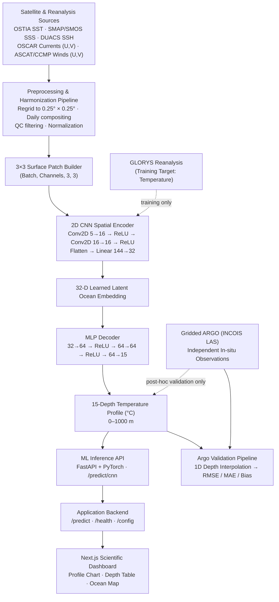

# OceanXRay 🌊 — OceanEmbed for SIH 2026 (PS #26066)

**OceanXRay** is a satellite-embedding-based deep learning platform that reconstructs the **15-depth vertical subsurface ocean temperature profile** of the **North Indian Ocean** from daily surface satellite observations — built for **Smart India Hackathon 2026 — Problem Statement #26066 (OceanEmbed)**.

The platform combines a **PyTorch CNN Encoder–Decoder** reconstruction model, a separate **FastAPI + PyTorch ML inference service**, and a **Next.js + TypeScript** scientific monitoring dashboard, validated post-hoc against real **Argo** profiling float observations.

---

## 🏆 Smart India Hackathon 2026 — Problem Statement

| Field Detail     |                                                                                                                                                       |
| ---------------- | ----------------------------------------------------------------------------------------------------------------------------------------------------- |
| **PS Number**    | PS #26066                                                                                                                                             |
| **PS Title**     | OceanEmbed – Satellite Embedding-Based Deep Learning Framework for Reconstruction of Subsurface Ocean Temperature from Surface Satellite Observations |
| **Organization** | Indian National Centre for Ocean Information Services (INCOIS), Ministry of Earth Sciences, Government of India                                       |
| **Theme**        | Disaster Management                                                                                                                                   |
| **Category**     | Software                                                                                                                                              |
| **Domain**       | North Indian Ocean — 5°N–30°N, 45°E–105°E                                                                                                             |

INCOIS delivers ocean advisory services across two domains — **disaster-related services** (tsunami, storm surge, high wave, swell surge and coastal current early warning) and **ecosystem-based services** (fisheries, coastal zone management, marine ecosystem monitoring). Subsurface temperature is a core variable behind both: it drives ocean heat content, stratification, marine heatwave detection, and data assimilation, but direct in-situ measurement (Argo floats, moored buoys, gliders) is spatially and temporally sparse. OceanXRay addresses this gap by learning a mapping from dense, continuous **satellite surface fields → subsurface thermal structure**, using compact learned embeddings rather than classical statistical interpolation.

---

## 🔬 Scientific Context & Domain

- **Target Domain:** North Indian Ocean — Arabian Sea, Bay of Bengal, Equatorial Channel, Andaman Sea 
  - Latitude: **5.0°N – 30.0°N**
  - Longitude: **45.0°E – 105.0°E**
- **Spatial resolution:** 0.25° × 0.25° (standardized across all input sources)
- **Temporal resolution:** Daily
- **Reconstruction depth range:** Surface → **1000 m**
- **Scientific Integrity Protocol:** Argo autonomous profiling float data is used **exclusively** for independent post-hoc validation. It is never used during training, normalization, loss computation, hyperparameter tuning, or checkpoint selection.

### 🌊 Standard Oceanographic Depths (15 levels, as per PS specification)

```
[0, 5, 10, 20, 30, 50, 75, 100, 125, 150, 200, 300, 500, 700, 1000] meters

```

- **5 m** — mixed-layer baseline
- **125 m** — lower thermocline transition

These realign the model to the PS-mandated depth grid (earlier prototype iterations extended to 1500 m with a coarser grid; the production configuration matches the SIH 2026 specification exactly).

---

## 🧭 System Block Diagram



**Data flow in words:** daily surface fields are harmonized to a common 0.25° grid and represented as a 3×3 spatial patch. The production CNN consumes five channels — **SST, SSH, U-current, V-current, and V-wind** — and encodes them into a **32-D learned latent ocean embedding**, which is decoded by an MLP into a continuous 15-depth temperature profile. GLORYS reanalysis temperature supplies training targets; independent Gridded Argo observations are reserved purely for post-hoc skill evaluation. The web application communicates with the deployed ML inference API for predictions.

---

## 🧠 Machine Learning Architecture

The production model is `OceanCNNEncoderDecoder`.

```text
3×3 Surface Patch × 5 Channels
│
├── Channel 0: Sea Surface Temperature (SST)
├── Channel 1: Sea Surface Height / Sea Level Anomaly (SSH)
├── Channel 2: Zonal Ocean Current (U-current)
├── Channel 3: Meridional Ocean Current (V-current)
└── Channel 4: Meridional Wind (V-wind)
       │
       ▼
┌─────────────────────────────────┐
│       2D CNN Spatial Encoder    │
│ Conv2D: 5 → 16 + ReLU           │
│ Conv2D: 16 → 16 + ReLU          │
│ Flatten: 16 × 3 × 3 = 144       │
│ Linear: 144 → 32                │
└─────────────────────────────────┘
       │
       ▼
   32-D Learned Latent Embedding
       │
       ▼
┌─────────────────────────────────┐
│          MLP Decoder             │
│ Linear: 32 → 64 + ReLU           │
│ Linear: 64 → 64 + ReLU           │
│ Linear: 64 → 15                  │
└─────────────────────────────────┘
       │
       ▼
15-Depth Continuous Temperature Profile (°C)

```

### Production Checkpoint Configuration

The deployed `cnn_best.pt` checkpoint contains the following exact architecture metadata:

| Parameter | Value |
|---|---|
| Input channels | 5 |
| Channel order | `sst`, `ssh`, `u_current`, `v_current`, `v_wind` |
| Patch size | 3×3 |
| CNN filters | 16 |
| Embedding dimension | **32** |
| Decoder hidden dimension | 64 |
| Output depths | 15 |
| Activation | ReLU |

The **32-D embedding is a learned latent representation produced by the CNN encoder**. It is not a separate pretrained satellite embedding model. The decoder consumes this representation and generates the 15-depth temperature profile.

### Model Specifications

| Parameter | Production value |
|---|---|
| Model | `PatchCNN` / `OceanCNNEncoderDecoder` |
| Input Tensor | `(Batch, 5, 3, 3)` |
| Input Patch | 3×3 spatial patch |
| Input Channels | SST, SSH, U-current, V-current, V-wind |
| CNN Filters | 16 |
| Encoder | 2D CNN: 5→16→16 + ReLU, then Flatten→32 |
| Latent Dimension | **32** |
| Decoder | MLP: 32→64→64→15 |
| Dropout | None in deployed architecture |
| Output Dimension | `(Batch, 15)` |
| Prediction | Vertical temperature profile (°C) |
| Maximum Depth | 1000 m |

### 🕐 Temporal Encoding

`predict(latitude, longitude, date_str)` — the application uses the supplied date to derive a seasonal phase during preprocessing. The current preprocessing pipeline uses that seasonal information to construct a climatologically coherent 3×3 patch; the deployed CNN itself receives only the five numeric production channels listed above.

---

## 📡 Training & Validation Datasets (per PS specification)

### Input (surface) variables

| Variable Product & Resolution Source  |                            |                                                        |
| ------------------------------------- | -------------------------- | ------------------------------------------------------ |
| SST                                   | OSTIA, 0.05°, daily        | https://doi.org/10.48670/moi-00168                    |
| SSS                                   | SMAP / SMOS, 0.125°, daily | https://doi.org/10.48670/moi-00051                    |
| SSH                                   | DUACS, 0.25°, daily        | https://doi.org/10.48670/moi-00145                    |
| Currents (U, V)                       | 0.25°, daily               | OSCAR L4 OC FINAL V2.0 (PO.DAAC)                       |
| Winds (U, V)                          | 0.25°, daily               | ASCAT-L2-Coastal / CCMP Winds 10m6hr L4 V3.1 (PO.DAAC) |

All inputs are regridded/interpolated to a common **0.25° × 0.25°, daily** grid before patch extraction.

> **Production model note:** the source/training data inventory includes SSS and both U/V wind components, but the deployed `cnn_best.pt` checkpoint currently consumes exactly five channels: SST, SSH, U-current, V-current, and V-wind. SSS is retained in the preprocessing metadata but is not passed into the deployed CNN input tensor.

### Training target

- **GLORYS Global Ocean Reanalysis** — temperature (https://doi.org/10.48670/moi-00021)

### Independent validation (never used in training)

- **Gridded ARGO** — INCOIS Live Access Server (LAS)
- Real Argo NetCDF profiles (`TEMP`, `TEMP_ADJUSTED`, `PRES`, `PRES_ADJUSTED`), quality-flag filtered, from the official Argo GDAC servers (`data-argo.ifremer.fr`, `usgodae.org`)

---

## 🧪 Scientific Integrity & Validation Protocol

Argo observations are reserved exclusively for post-hoc validation and are never used during model training, input normalization, loss computation, hyperparameter tuning, or checkpoint selection — matching the PS requirement to "evaluate the reconstruction using independent observations and standard skill metrics like correlation, RMSE, bias, etc."

**Validation run summary**

| Field Value            |                                                                                 |
| ---------------------- | ------------------------------------------------------------------------------- |
| Catalog                | Argo Real-Time Profiling Array (`indian_ocean_index.csv`)                       |
| Profiles within domain | 109,654 candidates                                                              |
| Validation sample      | 25 independent Argo profiling float cycles                                      |
| Evaluation mode        | Active OceanXRay CNN checkpoint through the deployed inference path                           |
| Interpolation          | Continuous 1D interpolation of Argo pressure levels onto the 15 standard depths |

### 📊 Depth-Stratified Validation Results

| Depth (m) Argo Mean (°C) Model Mean (°C) RMSE (°C) MAE (°C) Bias (°C)  |           |           |           |           |            |
| ---------------------------------------------------------------------- | --------- | --------- | --------- | --------- | ---------- |
| 0                                                                      | 29.42     | 28.94     | 0.945     | 0.866     | -0.486     |
| 5                                                                      | 29.38     | 28.83     | 0.954     | 0.857     | -0.549     |
| 10                                                                     | 29.33     | 28.81     | 0.945     | 0.829     | -0.523     |
| 20                                                                     | 29.22     | 28.77     | 0.945     | 0.811     | -0.455     |
| 30                                                                     | 29.01     | 28.56     | 0.943     | 0.773     | -0.449     |
| 50                                                                     | 28.22     | 27.51     | 1.189     | 1.037     | -0.711     |
| 75                                                                     | 26.38     | 25.01     | 2.269     | 1.894     | -1.367     |
| 100                                                                    | 22.93     | 21.65     | 3.192     | 2.357     | -1.275     |
| 125                                                                    | 18.91     | 18.57     | 2.035     | 1.729     | -0.340     |
| 150                                                                    | 16.56     | 16.43     | 1.450     | 1.208     | -0.130     |
| 200                                                                    | 13.97     | 14.32     | 1.030     | 0.771     | +0.348     |
| 300                                                                    | 11.86     | 12.30     | 0.684     | 0.466     | +0.441     |
| 500                                                                    | 10.49     | 10.66     | 0.391     | 0.301     | +0.169     |
| 700                                                                    | 9.46      | 9.27      | 0.363     | 0.267     | -0.197     |
| 1000                                                                   | 7.56      | 7.18      | 0.499     | 0.415     | -0.380     |
| **Full Column**                                                        | **19.85** | **19.46** | **1.403** | **0.972** | **-0.394** |

### 📈 Interpretation

- **Upper mixed layer (0–30 m):** RMSE holds steady around **\~0.94°C** — surface-derived inputs constrain near-surface temperature well.
- **Thermocline (75–125 m):** Largest error band; worst at **100 m** (RMSE 3.192°C, MAE 2.357°C, Bias -1.275°C). This region has strong vertical gradients shaped by mesoscale eddies, internal waves, and seasonal forcing — the hardest zone to reconstruct from surface signals alone.
- **Deep ocean (500–1000 m):** Error drops sharply (RMSE 0.36–0.50°C, MAE 0.26–0.42°C) — the model stabilizes at depth.
- **Full column (0–1000 m):** RMSE 1.403°C, MAE 0.972°C, Bias -0.394°C.

### 📐 Metrics used

```
RMSE = √(1/N × Σ(y_pred − y_actual)²)     # penalizes large errors
MAE  = 1/N × Σ|y_pred − y_actual|          # average absolute error
Bias = 1/N × Σ(y_pred − y_actual)          # negative = underestimate, positive = overestimate

```

---

## 🛠️ Technology Stack

| Layer | Technologies |
|---|---|
| Frontend | **Next.js 16.3.4, React 19, TypeScript** |
| Styling | **Tailwind CSS 4** |
| Maps | **Leaflet, React-Leaflet** |
| Visualization | **Recharts** |
| UI / Icons | **Lucide React** |
| ML Inference | **Python, FastAPI, PyTorch, Uvicorn** |
| Model | **CNN Encoder–Decoder + MLP Decoder** |
| Data / Training | **NumPy, Pandas, Xarray, NetCDF** |
| Deployment | **Vercel (Frontend), Render (ML Inference)** |
| Development | **Git, GitHub, Docker, npm** |

## 📁 Repository Structure

This repository contains the **OceanXRay web application**. It is a Next.js application that provides the interactive scientific dashboard and communicates with the deployed ML inference service.

```text
SIH26/
│
├── app/
│   ├── dashboard/
│   ├── about/
│   ├── globals.css
│   └── layout.tsx
│
├── components/
├── lib/
│   └── api.ts
├── public/
│
├── Dockerfile
├── .dockerignore
├── .gitignore
├── next.config.ts
├── package.json
├── package-lock.json
├── postcss.config.mjs
├── eslint.config.mjs
├── tsconfig.json
└── README.md
```

### Frontend responsibilities

| Component | Responsibility |
|---|---|
| `app/` | Next.js application routes, dashboard, scientific overview and server-side application logic |
| `components/` | Reusable UI and visualization components |
| `lib/api.ts` | Communication with the deployed prediction API and application service logic |
| `public/` | Static assets and screenshots |
| `Dockerfile` | Containerized frontend build and runtime |

## 🚀 Quick Start

Requires **Node.js 18+**.

```bash
npm install
npm run dev
```

The development server will be available at:

```text
http://localhost:3000
```

For a production build:

```bash
npm run build
npm start
```

### Live Frontend

- Dashboard: `https://sih-26-hp9x.vercel.app/dashboard`
- Scientific overview: `https://sih-26-hp9x.vercel.app/about`

## ⚙️ Service Configuration

The frontend communicates with the deployed ML inference service:

```env
NEXT_PUBLIC_API_URL=https://ml-model-oceanx.onrender.com
```

For local development, this variable can point to a locally running ML inference service.

Private credentials and local `.env` files should not be committed to the repository.

## 📡 API Reference

### ML Inference API

**Base URL:** `https://ml-model-oceanx.onrender.com`

### `GET /health`

Returns ML service availability, normalization status, active CNN channels and output depths.

### `POST /predict/cnn`

The production CNN accepts a 3×3 patch for each of its five input channels:

```json
{
  "patch": {
    "sst": [[0,0,0],[0,0,0],[0,0,0]],
    "ssh": [[0,0,0],[0,0,0],[0,0,0]],
    "u_current": [[0,0,0],[0,0,0],[0,0,0]],
    "v_current": [[0,0,0],[0,0,0],[0,0,0]],
    "v_wind": [[0,0,0],[0,0,0],[0,0,0]]
  }
}
```

The response contains the predicted temperatures at the 15 standard depths:

```json
{
  "model": "cnn",
  "depths_m": [0, 5, 10, 20, 30, 50, 75, 100, 125, 150, 200, 300, 500, 700, 1000],
  "temperature_degC": [25.55, 25.47, 25.39, 25.31, 25.20, 22.84, 19.86, 17.26, 15.00, 13.56, 11.08, 8.22, 6.78, 5.92, 4.81],
  "stats_used": true
}
```

> Response values above are illustrative; actual predictions are generated dynamically by the deployed checkpoint.

## 🛡️ Validation & Error Handling

- The application validates geographic and date inputs before requesting predictions.
- The ML inference API validates the expected 3×3 patch structure and model input channels.
- The frontend provides loading, error and connection-state feedback when the prediction service is unavailable.

## 🧪 Testing

```bash
# Lint
npm run lint

# Production build
npm run build
```

## 🔬 Reproducing the Argo Validation Benchmark

```bash
pip install netCDF4 xarray scipy requests pandas

# configure the active model/inference environment as required by the evaluation script
python evaluate_argo.py

```

The script reads the Argo candidate catalog, selects in-domain profiles, downloads independent Argo cycles from the official GDAC servers, quality-filters and interpolates them onto the 15 standard depths, runs active model inference, and computes RMSE / MAE / Bias — writing `argo_depth_metrics.csv` (depth-level) and `argo_test_results.csv` (station-level).

---

## 🌐 Live Deployment

OceanXRay consists of a web frontend and an independently deployed ML inference service:

```text
┌─────────────────────────┐
│    Next.js Web Application     │
│         Vercel          │
└────────────┬────────────┘
             │ HTTPS
             │ prediction request
             ▼
┌─────────────────────────┐
│    ML Inference API     │
│         Render          │
│   FastAPI + PyTorch     │
│      /predict/cnn       │
└─────────────────────────┘
```

### Live services

- **Frontend:** `https://sih-26-hp9x.vercel.app/`
- **ML Inference API:** `https://ml-model-oceanx.onrender.com/`

### API documentation

- **ML Swagger/OpenAPI:** `https://ml-model-oceanx.onrender.com/docs`
- **ML health:** `https://ml-model-oceanx.onrender.com/health`

The frontend communicates with the independently deployed ML inference service and visualizes the returned 15-depth temperature profile.

---

## 🔗 Frontend ↔ ML Service Integration

```text
User
  │
  ▼
Next.js Web Application
  │
  │ prediction request
  ▼
ML Inference API
  │
  │ /predict/cnn
  ▼
OceanCNNEncoderDecoder
  │
  │ 15-depth temperature profile
  ▼
Next.js Web Application
  │
  ├── Temperature profile chart
  ├── Depth table
  ├── Ocean map
  └── Prediction metadata
```

This separation keeps the web application and model-serving layer independently deployable.

## ⚠️ Scientific Interpretation & Limitations

- Validation sample is limited to 25 Argo cycles — a starting benchmark, not an exhaustive one.
- Strong spatial/temporal variability across the North Indian Ocean, especially thermocline dynamics driven by mesoscale eddies and seasonal forcing.
- Reconstructing 3D/vertical ocean state from 2D surface observations inherently loses information.
- Accuracy depends on the quality and availability of upstream satellite products (OSTIA, SMAP/SMOS, DUACS, OSCAR, ASCAT/CCMP).

The reported Argo benchmark is an empirical **post-hoc validation benchmark**, built in line with the INCOIS PS #26066 evaluation requirement — not a claim of universal oceanographic prediction accuracy.

---

## 🌊 Summary

**Surface observations → Learned satellite embedding → Subsurface thermal structure**

OceanXRay (OceanEmbed) combines deep learning, satellite oceanography, and independent Argo validation to reconstruct vertical ocean temperature structure across the North Indian Ocean — built for **INCOIS, Ministry of Earth Sciences**, under **Smart India Hackathon 2026, Theme: Disaster Management**.